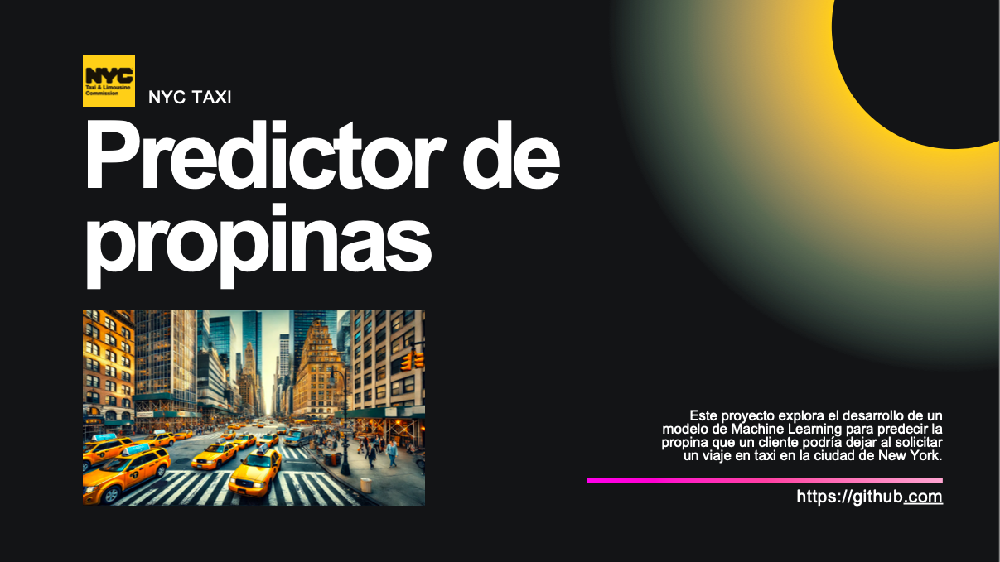

# ML-Predictor-de-propinas-de-taxi
Este proyecto utiliza Machine Learning para predecir propinas en viajes en taxi en Nueva York realizados durante el mes de septiembre de 2023.
Los modelos finales se encuentran dentro de Modelos/modelos finales, con el nombre de classifier_final y regresor_final, que incluye un regresor para cada grupo diferenciado en classifier. Tambien se incluye dentro de Modelos/Pruebas de modelos todas las pruebas realizadas hasta lograr el modelo final. Los classifiers del 1 al 5 utilizan el target sin transformar dividiendo por la distancia.

Los datos pesan demasiado como para subirlos a github, se pueden descargar desde el siguiente enlace: https://wetransfer.com/downloads/7d75ac14357e6206b619d26edbf90ff620241219211855/8af68c665057942642f9f6895c6393f320241219211912/e08988?t_exp=1734902335&t_lsid=5a7c72c0-25df-4123-983f-62fbe303a170&t_network=email&t_rid=Z29vZ2xlLW9hdXRoMnwxMDUyMTI5MzI5MTE2OTA3OTgyOTI%3D&t_s=download_link&t_ts=1734643152&utm_campaign=TRN_TDL_01&utm_source=sendgrid&utm_medium=email&trk=TRN_TDL_01
